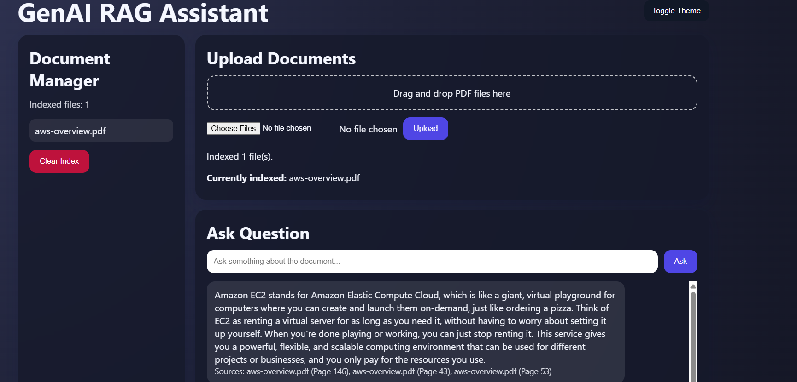

# GenAI RAG Document Assistant by Aman

A Retrieval-Augmented Generation (RAG) application that allows users to upload PDF documents and ask questions about them.

The system processes documents, converts them into embeddings, stores them in a vector database, and retrieves relevant context to generate answers using a local LLM.

## Features

* Upload PDF documents
* Ask questions about the document
* Context-aware answers using RAG
* Local LLM inference using Ollama
* Vector search with FAISS

## 🚀 Screenshot

## Tech Stack

* Python
* Flask
* LangChain
* FAISS Vector Database
* HuggingFace Embeddings
* Ollama (Phi3 / Llama3)

## Architecture

User Upload → Text Chunking → Embeddings → Vector Database → Retrieval → LLM → Answer

## Run Locally

Install dependencies:

pip install -r requirements.txt

Run Ollama model:

ollama run phi3

Start the application:

python app.py

Open browser:

http://127.0.0.1:5000
=======
# GenAI RAG Document Assistant by Aman

A Retrieval-Augmented Generation (RAG) application that allows users to upload PDF documents and ask questions about them.

The system processes documents, converts them into embeddings, stores them in a vector database, and retrieves relevant context to generate answers using a local LLM.

## Features

* Upload PDF documents
* Ask questions about the document
* Context-aware answers using RAG
* Local LLM inference using Ollama
* Vector search with FAISS

## Tech Stack

* Python
* Flask
* LangChain
* FAISS Vector Database
* HuggingFace Embeddings
* Ollama (Phi3 / Llama3)

## Architecture

User Upload → Text Chunking → Embeddings → Vector Database → Retrieval → LLM → Answer

## Run Locally

Install dependencies:

pip install -r requirements.txt

Run Ollama model:

ollama run phi3

Start the application:

python app.py

Open browser:

http://127.0.0.1:5000
>>>>>>> 4f8f4a9e0376907e5612551ef1a265cde893f419
